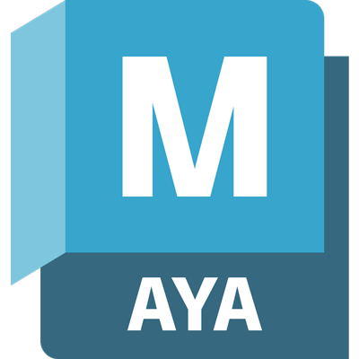

   <!--  -->
    

##

    

## 🚀 About Me

A passionate developer with a strong foundation in web development and a flair for 3D art and design. I enjoy building interactive and visually appealing applications, leveraging both my programming and artistic skills to create unique and engaging experiences. ✨

## 🛠️ Tech Stack

### 💻 Programming & Web Development
<!--

    
    
    
    
    
    
    

-->

 
   
    
    
    
   

   
    
    
   
    
    

   
    
    
    
   

   
   
   
    

### 🎨 3D Art & Design

- 🎮 **Modeling:** Maya, Blender, ZBrush
- 🖌️ **Texturing & Shading:** Substance Painter, Photoshop
- 🦴 **Rigging & Animation:** Maya, Blender
- 🎥 **Rendering:** Unreal Engine
- 👕 **Cloth Simulation:** Marvelous Designer

### 🔧 Additional Skills

- 🐧 **Operating Systems:** Linux (Debian, VM, DHCP servers)
- 🤖 **Artificial Intelligence:** I've created chatbots using custom LLMs and Vtube Studio to give them a 2D avatar but also using Unreal Engine 5 for 3D avatars.
- 🛠️ **APIs & Web Scraping:** I'm able to pull data from most APIs out there and scraping methods using Python and BeautifulSoup4

## 🌟 Featured Projects

### 🚀 [ReactNative Weather App]
An awesome project made for mobile (iOS and Android) to get the most accurate weather forecast!
- **🛠️ Tech Stack:** React Native
- **🔗 Link:** [Project Link](https://github.com/RyderBlack/ReactNative_WeatherApp)

### 🎮 [Uncanny Marvel Library]
Another cool project that pulls data from Marvel's API and get all the latest comic books.
- **🛠️ Tech Stack:** HTML, CSS, JavaScript, React.js, Bootstrap
- **🔗 Link:** [Project Link](https://uncanny-marvel-library.surge.sh/)

### 🎨 [3D Projects]
My amazing 3D creations!
- **🎮 Tools:** Maya, Substance Painter, Zbrush, Marvelous Designer and Unreal Engine 5
- **🔗 Link:** [Portfolio Link](https://www.artstation.com/ryhverse/)

## 📫 Connect With Me

    
    
    

---

&nbsp;

--

  

  

<!--

    

    

-->
<!--

    

-->

---

💡 Let's connect and build something amazing together! 🚀

<!--
**RyderBlack/RyderBlack** is a ✨ _special_ ✨ repository because its `README.md` (this file) appears on your GitHub profile.

Here are some ideas to get you started:

- 🔭 I’m currently working on ...
- 🌱 I’m currently learning ...
- 👯 I’m looking to collaborate on ...
- 🤔 I’m looking for help with ...
- 💬 Ask me about ...
- 📫 How to reach me: ...
- 😄 Pronouns: ...
- ⚡ Fun fact: ...

### 🎵 Currently Vibing To

-->
